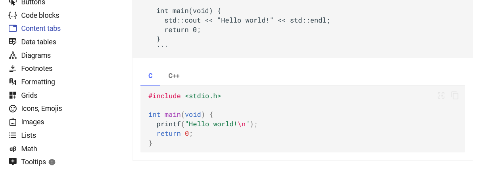

======================
2023/8~2024/1
======================
技術関連ITなどのことについてのメモとか日記のようなもの

-------------------------------
2023/8
-------------------------------

2023/7/31
===========================
* `aws workshop <https://catalog.us-east-1.prod.workshops.aws/workshops/2e48b9fc-f721-4417-b811-962b7f31b61c/en-US>`__ のcloudtrail目次だけ見る。良さそうなので時間見つけてやる
* テーブルの部分dumpでてこずる。日付のフォーマットがちがうとなってたが、どこが違うのかわからんかったのえ
  insert文をdjモデルと使って書く。（あまり効率的なやり方ではなさそうだが）

::
    f"insert into {table} ...{record.id},"

  geometryがはいると4,5GBになることも普通なので効率的なやりかた考えたほうがいい

* instanceに入れないレスポンス返さなくなったらalarm使ってインスタンスの再起動をするようにしたほうがいい
* aws backupが意外と中国本土のregionで提供されてない機能が多い

2023/8/3
===================
* pydanticをさわる、fastapi[all]でいれるとveresion2じゃなかった

2023/8/5
=======================
wslでvscodeが起動できなくなる。/etc/wsl.confをenable=Falseにして
wslを再起動すると解決した

https://github.com/microsoft/WSL/issues/8952

2023/8/16
==================

* target groupのtargetがすべてunhealthyだと普通にリクエストするらしい
  
  aws docの原文を最初読んだときは意味がわからなかったが、

  `class method blog <https://dev.classmethod.jp/articles/tsnote-alb-targetgroup-unhealthy-002/>`__

2023/8/17
=================

`django-ninja <https://django-ninja.rest-framework.com/>`__
-------------------------------------------------------------
* django pydanticで検索してたらたまたま見つける
* fastapiのようなinterfaceを備えたdjangoAPIを作れるツール。fastapi使いたいけどdjango-modelになれた人にとってはかなり使いやすそう
* 日本語でのページは少なく、まだ日本では広まってない？
* localで試そうとしたがなぜか表示がうまくいかず・・・・・
* restframeworkよりは気軽に書けそう
  

::

    from django.contrib import admin
    from django.urls import path
    from ninja import NinjaAPI

    api = NinjaAPI()

    @api.get("/add")
    def add(request, a: int, b: int):
        return {"result": a + b}

    urlpatterns = [
        path("admin/", admin.site.urls),
        path("api/", api.urls),
    ]

documentツール
-----------------
* fastapiやninjaのdocumentが同じ形式だったので調べたらはmkdocsで作られている
* 独自markdownでかけるのは、マイナなrst使うsphinxより強味かもしれない
* `sphinx theme<https://sphinx-themes.org/>`__ を見ていると同じようなのがだいたいそろってるのでoutputとしてそんなに変わらないかも

python multiprocess
--------------------
* chunk sizeについて `stack over flow <https://stackoverflow.com/questions/3822512/chunksize-parameter-in-multiprocessing-pool-map>`__

2023/8/18
=================
debug
--------------------------
sourceコードをreplから見る方法。デバッグしたいときにその場で見れる
https://maku77.github.io/p/xbucsaq/

::

    >>> import inspect
    >>> import os
    >>> print(inspect.getsource(os.path.abspath))
    

documentツール
--------------------------
とりあえずmkdocsも触ってみた感想

mkdocsのいい点
__________________________
* クラスメソッドなどはsphinxじゃなくて、mkdocsを社内で使ってるよう。markdownのほうがrstより使い慣れている人が多いからとかいう記載があった
* 両方使ってみたが、themeの多さはsphinxのほうが強いところか、
* materialのtab表示は便利かなと思う [#]_
* ただsphinxで書いてしまった既存documentを移行するのはそれなり大変そうではある

  
.. [#] shpinxも一応materialがthemeとして存在しているが、このタブ機能はないっぽい

sphinxのほうがいい点
__________________________
* themeの多さはsphinx
* ナイトモードがあるthemeがあるのもsphinx
* 長く使われてるライブラリはsphinxが多い印象django/pytest/celery etc

restframework
--------------------------
* viewsetで書いてみたが確かに省略できるようにはなるのだが、たまにしかいじらない場合わかりにくい
* 初心者に少しやりにくさがある
* django-ninjaとかfastapiのほうが直観的でわかりやすい

django-adminの二要素認証
--------------------------
* `django-admin-two-factor-auth <https://django-admin-two-factor-auth.readthedocs.io/en/latest/>__`
* google-authenticatorを使っている、設定自体は簡単だがinstalled_appの書き順があるらしく、それを間違えていて手間取った。
* docで目立つように↓みたいに書いてくれたらよいのだが・・・・
* docを読む限り強制するとかはできないっぽい

.. warning:: 
    
    順番注意

2023/8/19
==========
documentツール
---------------
* docstringからの出力機能はmkdocsのほうが見やすい感じをsource-code自体もオンオフ表示できたりと
  使いやすい印象を受けた
* autonumberingがないのはmkdocsのマイナス

2023/8/22
=====================
documentツール
----------------------------
* sphinxの公開をread-the-docsに移行した。mkdocsですでに実施していたので同じ要領ですぐできた
* `ray <https://docs.ray.io/en/latest/>`__ のドキュメントがいい感じだったので調べたらsphinxせいだった
* rayは `mystmd <https://mystmd.org/guide/dropdowns-cards-and-tabs>`__ 使ってmarkdownで書かれていた.
* sphinxだと最新に対応してないライブラリとかthemeが意外とおおかった

2023/8/23
=======================
.. todo::  読んでおくと良さそうなdocument

  | https://docs.python.org/3/library/multiprocessing.html
  | https://docs.python.org/ja/3/library/queue.html
  | https://docs.geoserver.org/latest/en/user/

* queue.put(1,block=False) のblockの意味
* mp.async_map()のasync_mapとか

2023/8/24
===============================
documentツール
----------------------------
* sphinxでsvgを表示する方法

https://stackoverflow.com/questions/34777943/insert-clickable-svg-image-into-sphinx-documentation

.. todo:: 
  https://numpy.org/doc/stable/reference/generated/numpy.ndarray.view.html

2023/8/30
========================

documentツール
-----------------------
* fluent-pythonのサイトをみたらたまたま見つける、goで書かれているらしいが、ちょっとマイナー（？）

aws
--------------------
* s3で大量のファイルをアップロードするとき（合計40GB）を送るとき、aws-cli のcp recursiveでするのが一番早かった。
* aioboto3で非同期にすれば早いかと思ったが、awscliのほうがファイス数が増えるにしたがって早くなっていった。
* 

.. todo::  

  aws s3 cpのrecursiveの実装を確認してみる.
  さっとgithubで検索してみたがすぐにはわからなかった・・・・

fluent python
-------------------
* 前記のuploadの速度に関連して fluent pythonを読んでいたら `httpx <https://www.python-httpx.org/async/>`__ なるlibraryが記載されていた
* requetsと違って、asyncにも対応しているらしく良さそうなので試してみる 
* ちなみにドキュメントはmkdocsで書かれていた。

その他
----------------
これを書いているときちょうどsphinxのvscode previewが一時的に↓のようなエラーがでて
previewが使えなくなったが、.vscode/settings.jsonから **,** がぬけてjsonが壊れていたのが原因だった。
* vscodeのextentionのとかやったが関係なかった・・・

::

  command restructuredtext.showpreviewtoside not found

2023/8/31
==================

fluent python
--------------

tqdm
______________
* for文などののprogressbarに使えるtqdmが参考になった。見た目もきれいなのでよい
* コマンドラインに-vで詳細をだすかなども参考になった。
  pytestなどにも使われていることを思い出した。
  コマンドラインツールで適度に表示を出す方法として使えそう

.. code-block:: python
  
  from tqdm import tqdm
  import time

  for i in tqdm(range(100)):
      time.sleep(1)
  #100%|██████████| 100/100 [01:40<00:00,  1.00s/it]

POSTGIS
---------------
* 不正なポリゴンをなおすのにst_buffer(geom,0)で解決ができることがある。ちょうど8の字がたになっているときに、使えるらしい・・・
  一応オフィシャル `document <https://postgis.net/documentation/manual/>`__ [#]_ にも次のような記載がある

::

  e input object is much larger than a UTM zone or crosses
  the dateline Buffer output is always a valid polygonal geometry. 
  Buffer can handle invalid inputs, so buffering by distance 0
  is sometimes used as a way of repairing invalid polygons.
   can also be used for this purpose. Buffering is sometimes used to
  perform a within-distance search. For this use case it is more efficient to use .
   This function ignores the Z dimension. It always gives a 2D result even when used on a 3D geometry.

.. [#] 詳細理由はよくわかってない。ただドキュメント自体は900p近くあってかなりしっかりしてるので読む価値はありそう。例えばspatial indexなどは
       geodjangoまかせで使ってるのでいいかも

----------------------------
2023/9
----------------------------

2023/9/1
=========================

QGIS
------------------------------
*  単純にintersectsとりたいだけならqgisのほうがよい。map上での確認もできるのでミスにも気づきやすい。 `参考 <https://gis.stackexchange.com/questions/18453/create-a-new-layer-from-overlap-between-two-layers>`__

2023/9/2
====================
fluent python
-----------------
* pythonの実装見たいときは `cpython <https://github.com/python/cpython>`__ を参照するといい
* 

2023/9/4
===========================
fluent python
-------------------
* dict/listなど直接継承すると一貫性のない動作をすることがある。 `pypy <https://doc.pypy.org/en/latest/cpython_differences.html#subclasses-of-built-in-types>`__ 記載の例だと

.. code-block:: python

    class D(dict):
    def __getitem__(self, key):
        if key == 'print':
            return print
        return "%r from D" % (key,)

  class A(object):
      pass

  a = A()
  a.__dict__ = D()
  a.foo = "a's own foo"
  print(a.foo)
  # CPython => a's own foo
  # PyPy => 'foo' from D

  print('==========')

  glob = D(foo="base item")
  loc = {}

   
aws
--------------------
* s3のevent通知はtag変更とかでもできる `Supported event destinations <https://docs.aws.amazon.com/AmazonS3/latest/userguide/notification-how-to-event-types-and-destinations.html#supported-notification-destinations>`__

2023/9/5
======================
aws
-------------------------
* ルートテーブルとAClの違いは何かとふと思ったが、 `stackoverflow <https://stackoverflow.com/questions/60211533/what-is-the-diference-between-network-acl-and-route-tables-in-aws>`__ が参考になった
* cloud9はprivate subnetでも使える。gatewayのせっていが必要 `参考 <https://www.bioerrorlog.work/entry/private-subnet-cloud9>`__]

python
----------------------------
* offline環境でpythonのversionを上げようとして、最初pyenvを検討したが一番らくなのは公式のtgzをコンパイルインストールする形式っぽい `参考 <http://infra-se-no.blog.jp/archives/16962028.html>`__ [#]_ 

::

      #https://www.python.org/ftp/python/
      #tar xvzf Python-3.8.0a1.tgz

      #cd Python-3.8.0a1

      #./configure --prefix=/usr/local/python

      #make

      #make install

      #vi ~/.bash_profile 

      export PATH=$PATH:〜〜〜〜〜〜の後ろに「:/usr/local/python/bin」を追記して保存する。

      #ln -s /usr/local/python/bin/python3 /usr/local/bin/python

      #python

.. [#] オフライン下でのpyenvも詳細に書かれたblogがあったが手順が長すぎて断念した

2023/9/6
===============================

消去したユーザーがオーナーのリソースの扱い方
--------------------------------------------------
created_byで指定されたユーザーを消したとき、messageを残しておくべきかという問題。

::

    #イメージ
    class Message(Model):
        created_by=models.ForeignKey(User...
        message=models.CharField(max_length=250,.....

| チャットツールとかだと(teamsとか)削除されたユーザーもメッセージは残している。残さないと会話の意味とかが分からなくなるからだろう。
| ただしこの場合削除されたユーザーが再度登録した場合(emailがユニークかつ必須の条件のとき)どのように扱えばいいのかがちょっと謎。
| 削除フラグかつ同じemailがあるときは再登録できるようにコマンドを変えてあげればいいのだろうか？
 

`参考 <https://ux.stackexchange.com/questions/10329/whats-the-best-way-to-handle-deleted-user-accounts-on-a-social-app>`__

2023/9/7
===================================================
code-commitのクロスアカウントでの使用
--------------------------------------
vpc endpointを使えばできる、ただグループポリシーとかの指定があると引っ掛かるかの静画あるぞ

2023/9/10
==========================

コンテナセキュリティ
-----------------------

* コンテナ側もホストと同じOSを共有している.『共通のOSで別のディスとリビューしょんを動かしているようにふるまっているだけ・・・』[#]_ 
 

::

    docker run --rm -it fedora:38 /bin/bash

    [root@53ccc165b45b /]# uname -a
    Linux 53ccc165b45b 5.15.90.1-microsoft-standard-WSL2 #1 SMP Fri Jan 27 02:56:13 UTC 2023 x86_64 GNU/Linux

.. [#] `基礎から学ぶコンテナセキュリティ<https://gihyo.jp/book/2023/978-4-297-13635-2>`__

* alpineの場合はbashでなくash
::

    docker run -it --rm myimage:test  /bin/ash

.. todo:: 

  docker公式のsecurityの項目読んでおく
  https://docs.docker.com/develop/security-best-practices/#check-your-image-for-vulnerabilities

2023/9/11
===========================
aws
------------------
gateway endpoint設定してもs3に接続できない(access denied)
_____________________________________________________________________
* 最初はec2のロールが不足していたので、s3fullacessをロールにたしてみたが、変わらなかったので再起動したが変わらず。
* デフォルトで適用されている一時クレデンシャルを無効化したらできた [#]_ 
  
.. [#]  https://www.yamamanx.com/cloud9-default-setting-access

cloud9でlocalアップロードしたファイルがunzipできない
_______________________________________________________

* s3からブラウザ経由でダウンロードして、cloud9のlocalファイルのアップロードをおこなったファイルだとなぜかunzipできない
* 結局,s3から直接cliでダウンロードしたら問題なくunzipできた。

trend-micro cloud oneのエイリアス設定
_________________________________________
| 圧縮されたファイルに含まれるファイル数の上限設定時にエイリアスに反映する必要があるが、デフォルトで設定されているエイリアス名をversioningで更新する必要がある
| ドキュメントにははっきり書いていなかったので、新しくエイリアスを作っていた

  
2023/9/12
====================================

aws
--------------------------
awscliが使えない
_________________________________________

pythonのpipように使ってるproxy環境変数を消したら使えるようになった。NO_PROXYで指定しているのだがなぜかよくわからない

::

    export -n http_proxy
    export -n https_proxy
    
    export NO_PROXY=169.254.169.254

cloud9のdiskが足りない
__________________________
https://blog.proglus.jp/4574/ の記載の通りinstanceをいったん停止してec2 consoleからdiskを増やしただけで、root voluemeが増加する。（ubunuで試した）

2023/9/15
=======================================
django unittestが失敗
---------------------------------
**django.db.utils.ProgrammingError: permission denied to create extension "postgis"** で失敗する。
unittest字に別のデータベースを作るときにpostgisをinstallする権限がないのが原因、
とりあえずtemplate1にpostgisを追加するようにしたら動いた。

https://stackoverflow.com/questions/35209013/testing-django-app-with-postgis-backend
https://postgresweb.com/what-is-template1

.. todo:: 
  
    django `公式docのテスト <https://docs.djangoproject.com/en/4.2/topics/testing/overview/>`__ を見ておく  

unittestのpatchについて
----------------------------
いままで各テストでmockのdecoratorを使っていたが、
全部のTestClassのすべてのテストケースで使うような場合だったら、pytestのfixtureにまとめてしまったほうが見やすい。[#]_

またpytest-mock使えばimportせず似たように使える。

`stack-overflow <https://stackoverflow.com/questions/59045200/proper-way-to-return-mocked-object-using-pytest-fixture>`__ のコード例

.. code-block:: python
  
    @pytest.fixture()
    def mocked_worker():
        with patch('test.test_module.os.getcwd', return_value="Testing"):
          result = Worker()
          yield result

alarm

.. info::
    
    
    effective pythonのmockクラスとpatchの使い分けも参考になる。

.. [#] djangoアプリで、setupとして(1)token取得(2)自分のユーザー情報取得してから、各エンドポイントをテストする必要があったが、毎回mockを書くのもめんどくさかったので探したらみつかった

2023/9/25
=============================

postgis
----------------------
* st_validdetailでinvalidなときの理由がわかる
* lineとpolygonの共有長さがわかる https://gis.stackexchange.com/questions/27259/getting-the-length-of-line-inside-polygon
  

2023/9/28
================================

gis
----------------------------------

QGISで選択したポリゴンのwktの取得
_________________________________
* 地物情報を表示→選択知物をクリップボードにコピー（ただなぜかポリゴンなのにmultipolygonででてしまった) https://gis.stackexchange.com/questions/272753/is-there-a-way-in-qgis-3-to-get-a-selected-feature-wkt
  

multipolygon→polygonの修正(shapely)
________________________________________
* list(multipolygon)でできると思ったがmultipolygon.geomsにする必要があった https://stackoverflow.com/questions/38930192/how-to-extract-polygons-from-multipolygons-in-shapely

.. code-block:: python 

  >>> a="MultiPolygon (((139.64669465088675793 38.48269143041795814, 139.71176749695203512 38.05540037864444258, 140.14953027957281506 38.06471602951130961, 140.33291739121125374 38.36682853913743685, 139.64669465088675793 38.48269143041795814)))"
  >>> multi=wkt.loads(a)
  >>> multi.is_valid
  KeyboardInterrupt
  >>> polys=list(multi)
  Traceback (most recent call last):
    File "<stdin>", line 1, in <module>
  TypeError: 'MultiPolygon' object is not iterable
  >>> polys=list(multi.geoms)
  >>> polys[0]
  <POLYGON ((139.647 38.483, 139.712 38.055, 140.15 38.065, 140.333 38.367, 13...>
  >>>

2023/9/29
====================================

postgres
-------------------------------------

他のテーブルの値でテーブル更新
_______________________________
joinを使わずに↓のような形式で実効できる。SQLクックブックを見て知った。

https://qiita.com/hiro5963/items/ff1740924f218b5667e9

::

  update A set key=value where B where A.id=B.id

window関数のランクの結果をwhereする
____________________________________

---------------
2023/10
---------------

2023/10/4
===================

sentinel2画像
-----------------
* copernicusでofflineと表示されている画像はすぐに取得できない。数日かかるという記述おあったが、1時間位でダウンロードできるようになった
* APIで画像を取得するときはuuidが必要だが、copernicusのuiには表示されてない
  

  
 

 2023/10/06
=========================

polygonの二次元変換(shapely)
------------------------------
3次元ポリゴンを2次元ポリゴンに変換したいとコード。
force_2dというのもあるらしいのだがなぜか使えなかった。。。

https://gist.github.com/rmania/8c88377a5c902dfbc134795a7af538d8

.. code-block:: 

    geom = shapely.wkb.loads(
        shapely.wkb.dumps(geom, output_dimension=2))

  

2023/10/8
==================================
namespace
---------------------
* pidが含まれるpid namespace(pidns)の確認
::
  # echo $$

  # ls -l /proc$$/ns/pid
  lrwxrwxrwx 1 root root 0 Oct  8 23:33 /proc/1/ns/pid -> 'pid:[4026532125]'

* root pid nsを除けば、異なるpid nsどうしでは見えない。

2023/10/9
==========================-
linuxでのsystemcallの表示方法 (-Tで各処理にかかった時間もわかる)

::
  #-Tで処理時間も表示
  $ strace -T -o hello.log echo hello

2023/10/10
===============================
docker
---------------------
* kernelはホストと共有
::

  uname -a

2023/10/11
======================
system programming
--------------------
apt installだけだとversionが古いのしか(1.18)いれられずvscodeでdebuggerが使えなかった

::

  sudo add-apt-repository ppa:longsleep/golang-backports
  sudo apt install golang

githubのemail設定
-------------------------
https://zenn.dev/kaluna_hart/articles/github-email-error

2023/10/12
========================

python勉強会
----------------------------------
久しぶりに参加したが、パッケージの解決の話が興味深かった。pipenv/poetryの速度差なども依存解決のアルゴリズムが関係しているらしい
関連史料もまとめられているので読んでみる

https://gist.github.com/vaaaaanquish/1ad9639d77e3a5f0e9fb0e1f8134bc06#file-python-package-manager-md

2023/10/13
===================
setuptools
--------------------  
pip isntall Package-A[PDF]みたいに追加機能のインストールみたいなことも↓の書き方で指定できる。
またwindowsだけはこのライブラリがいるみたいなのもできるらしい（https://setuptools.pypa.io/en/latest/userguide/dependency_management.html）

.. code-block:: 
 
  [metadata]
  name = Package-A

  [options.extras_require]
  PDF =
      ReportLab>=1.2
      RXP

2023/10/14
=================================

fluent python
----------------
* __init__はinitializerでconstructorは__new__
* __dict__.update(`kwargs**`) でまとめてフィールド作成できる。（だが）予約語と衝突すると可能性もあるので注意) [#]_ 

.. [#] 例えば変数にclassは使えない(self.class=classみたいなのはできない)

2023/10/15
======================

fluent python
----------------------
* class変数はインスタンス変数で上書きされる
* varsではインスタンス変数が表示
* delでインスタン変数を消せる。（クラス変数は残る）
* propertyは{class}.{property名}でうわがきできる
  
.. code-block:: python

    >>> class Dummy:
    ...     data="class variable"
    ...     @property
    ...     def prop(self):
    ...         return "prop in method"
    ... 
    >>> 
    >>> dummy=Dummy()
    >>> vars(dummy)
    {}
    >>> dummy.prop
    'prop in method'
    >>> dummy.prop="overrideen"
    Traceback (most recent call last):
      File "<stdin>", line 1, in <module>
    AttributeError: can't set attribute 'prop'
    >>> dummy.data="overrideen"
    >>> dummy.data
    'overrideen'
    >>> vars(dummy)
    {'data': 'overrideen'}
    >>> del dummy.data
    >>> dummy.data
    'class variable'
      

2023/10/17
====================================

django-gisで動的なfilteringのやり方
-----------------------------------------------------
get_feature_typesに処理を書く。self.request.GETでqueryparamを取得し
filter条件に組み込めばよい

  .. code-block:: 
       
    class PlacesWFSView(WFSView):
        """An simple view that uses the WFSView against our test model."""

        xml_namespace = "http://example.org/gisserver"

        # The service metadata
        service_description = ServiceDescription(
            title="Places",
            abstract="Unittesting",
            keywords=["django-gisserver"],
            provider_name="Django",
            provider_site="https://www.example.com/",
            contact_person="django-gisserver",
        )

        # Each Django model is listed here as a feature.
        feature_types = [
            FeatureType(
                Place.objects.all(),
                fields="__all__",
                other_crs=[RD_NEW]
            ),
        ]

        def get_feature_types(self) -> list[FeatureType]:
            """Return all available feature types this server exposes"""
            #print(self.request)
            print(type(self.request))
            print(self.request.GET.get("SERVICE"),self.request.GET.get("VERSION"))
            #self.feature_types[0].queryset=Place.objects.filter(id=1)
            return self.feature_types

    

=============================
vimの設定($HOME/.vimrc)
----------------------------------

2023/10/26
==================================

django restでのgeonjsonのかえしかた
-----------------------------------------
shapley.to_geojsonをpydantic.basemodelのfieldで返していたが、
client側にはただの文字列として返ってしまうのでjson.dumpsとかでdictにして返す

djangoのsettings.pyを見直そう
----------------------------------
各モジュール内にべた書きを避けるためにsettings.pyにいろいろかきすぎていることがある。
コードをきれいに書く方法論は多いが設定ファイルを同期例にするかは余り論じられてない気がする

あと使われなくなった機能のsettingがのこっているのは消しておこう

一般的な名称のget-queryが競合しないか注意
---------------------------------------------------

------------------
2023/11
------------------

2023/11/1
=========================

dockerでtkiner
-------------------

wsl2でtkinterをdockerで動かしてみ。optionで環境変数とvolumeマウントしてやる必要がある

::
    #https://qiita.com/U-1F992/items/33497c629144a62674d4
    > docker build --tag tkinter .
    > docker run -it --env "DISPLAY=${DISPLAY:-:0.0}" --volume /mnt/wslg/.X11-unix/:/tmp/.X11-unix dummy

::

    FROM python:3.11.5
    WORKDIR /app
    #COPY requirements.txt requirements.txt
    RUN pip3 install customtkinter packaging
    COPY . .

    CMD ["python" , "script.py"]

::

    import customtkinter

    def button_callback():
        print("button pressed")

    app = customtkinter.CTk()
    app.title("my app")
    app.geometry("400x150")

    button = customtkinter.CTkButton(app, text="my button", command=button_callback)
    button.grid(row=0, column=0, padx=20, pady=20)

    app.mainloop()

2023/11/3
=========================

postgres
--------------------------
一回読んでほかってたlearn postgresを読見始めた。
role/group/firewallなど普段django経由だと意識しないところがかいてあるので読んでおこう

便利コマンド
------------------------
今更だがtreeコマンドディレクトリの階層構造を表示できることを知った。

::

  $ tree -L 1
  .
  ├── ]
  ├── docs
  ├── Pipfile
  ├── Pipfile.lock
  ├── poetry.lock
  ├── __pycache__
  ├── pyproject.toml
  ├── README.md
  ├── readthedocs.yml
  ├── requirements.txt
  ├── venv
  └── zz.py
  

2023/11/5
=======================

ubuntuイメージ+miniconda
---------------------------

::

    FROM ubuntu:22.04
    RUN apt update && apt -y upgrade && apt install -y wget
    WORKDIR /app
    RUN mkdir ./miniconda3
    RUN wget https://repo.anaconda.com/miniconda/Miniconda3-latest-Linux-x86_64.sh -O ./miniconda3/miniconda.sh

    
     
* proxyを設定してるか？
* --profileを指定しているか？
* --regionでregionを指定しているか

::

    aws s3 cp s3:// {local_path} --recursive --profile profile --region ap-northeast-1

2023/11/6
============================
miniconda用のimage
---------------------
とりあえずURLだけ

* https://repo.anaconda.com/miniconda/ 
* https://docs.conda.io/projects/miniconda/en/latest/miniconda-install.html
* https://stackoverflow.com/questions/42352841/how-to-update-an-existing-conda-environment-with-a-yml-file
* https://qiita.com/kuboko-jp/items/6388c186e16028d3e699

Dockerfileのlinter
------------------

image-scan
--------------------

2023/11/15
==================================

* https://stackoverflow.com/questions/75845639/how-to-pass-the-url-into-the-view-context-in-django

2023/11/17
===============================

jp2からjpgのサムネイル作成
-----------------------------------
Sentinel2がjp2形式でそれをjppgに変更した際に使った。

code-block:: 

    from PIL import Image   
    image=Image.open("T54SUF_20210512T012659_TCI_60m.jp2")
    >>> image
    <PIL.Jpeg2KImagePlugin.Jpeg2KImageFile image mode=RGB size=1830x1830 at 0x29BD7322090>
    >>> image.convert("RGB")
    <PIL.Image.Image image mode=RGB size=1830x1830 at 0x29BD55E5D10>
    >>> image.save("hoge.jpg")
    >>>

.. warning:: 

    `CopernicusOpenAcessHubのサイト更新 <https://scihub.copernicus.eu/>`__したのでファイル構成が変わっている可能性あり・・・・・

gdalのpyton imageでのbuild方法
----------------------------------------------
condaを使った倍のbuildが遅すぎたのでこちらで試したらすぐbuildできた。https://zenn.dev/straydog/articles/a5c005cc7cfe22

leaflet
----------

polygonをクリックでfeatureの属性情報をformに入力させる
__________________________________________________________

djangoのcharfieldのmax_length
----------------------------------

| The maximum length (in characters) of the field. The max_length is enforced 
| at the database level and in Django’s validation using MaxLengthValidator. 
| It’s required for all database backends included with 
| Django except PostgreSQL, which supports unlimited VARCHAR columns.

2023/11/19
========================
django
------------------------------
* search_help_textで検索フォームにhelptextをかける（デフォルトだとどのフィールドで検索してるのかわからない）
* 

::

    @admin.register(Post)
    class PostAdmin(admin.ModelAdmin):
        list_display=["title","slug","author","publish","status"]
        list_filter=["status","publish","author"]#filterできる変数#このままだとstatusは表示名では検索できない。dbには二文字短縮形でいれているから
        search_fields=["status","title","author__username"]#auhroで検索試合場合は？？？？
        raw_id_fields=["author"]
        prepopulated_fields={"slug":("title",)}
        search_help_text = f'search in: {", ".join(search_fields)}'

subprocessでdocker動かしたときのエラー
--------------------------------------------
subprocesで実行した場合でもreturn_codeみれば正常終了したかどうかは確認できる

.. code::
    #script.py
    raise Exception()

.. code:: 

    >>> import subprocess
    >>> task=subprocess.run("docker run --rm fail /bin/bash -m python script.py",shell=True,stdout=subprocess.PIPE,stderr=subprocess.PIPE)
    >>> task
    CompletedProcess(args='docker run --rm fail /bin/bash -m python script.py', returncode=126, stdout=b'', stderr=b'/bin/bash: cannot set terminal process group (-1): Inappropriate ioctl for device\n/bin/bash: no job control in this shell\n/usr/local/bin/python: /usr/local/bin/python: cannot execute binary file\n')
    >>> task.
    task.args                task.check_returncode()  task.returncode          task.stderr              task.stdout              
    >>> task.returncode
    126
    >>> task.stderr
    b'/bin/bash: cannot set terminal process group (-1): Inappropriate ioctl for device\n/bin/bash: no job control in this shell\n/usr/local/bin/python: /usr/local/bin/python: cannot execute binary file\n'
    >>> tas.stdout
    Traceback (most recent call last):
      File "<stdin>", line 1, in <module>
    NameError: name 'tas' is not defined. Did you mean: 'task'?
    >>> task.stderr
    b'/bin/bash: cannot set terminal process group (-1): Inappropriate ioctl for device\n/bin/bash: no job control in this shell\n/usr/local/bin/python: /usr/local/bin/python: cannot execute binary file\n'
    >>> task.stdout
    b''

-----------------------------------
2023/12
-----------------------------------
2023/12/4
=============
sentnienl2
--------------------------
* T **53SLT** の太字部分がgridID 詳しくは `公式<https://sentinels.copernicus.eu/web/sentinel/user-guides/sentinel-2-msi/naming-convention#main-content>`__

::

  S2B_MSIL2A_20231204T015039_N0509_R017_T53SLT_20231204T034206.SAFE

2023/12/5
======================

celery
--------------------------------

queueの長さがmaxのときの設定
______________________________
defaultのままだとqueueが最大に達しても、エラーも投げずにただenqueされない。（行方不明状態）
githubのissueとかみると公式documentとかにも記載がない・・・・・

https://stackoverflow.com/questions/35996065/what-is-the-correct-way-to-confirm-a-publish-in-celery

TTLの設定
________________________________

2023/12/11
=============================

prepositionとしてのabsent
============================
* withtoutと同義で、formalな書き言葉で使われるらしい(Chatgptによると)。

::

  “China is facing a massive overhang with all the coal plants it has built, and many of them are still new, so absent taking those plants offline, there’s a considerable attractiveness to using carbon capture,”
   said Roman Kramarchuk, head of future energy outlooks at S&P Global Commodity Insights. “

::

  #chatgptの回答
  Is absent often used like this as a preposition?
  >ChatGPT

  The use of "absent" as a preposition is less common in everyday language, and it might sound somewhat formal or literary. In more casual or conversational English, you're likely to encounter alternatives like "without" or "excluding." 
  However, in more formal or technical contexts, you might come across "absent" used as a preposition to indicate the absence or exclusion of something.

2023/12/15
================================

sentinel2tcl画像のjp2→png変換
-------------------------------
用途
___________

コマンド
_____________
PILで一発で変換できる。

::

    >>> from PIL import Image, ImageFile
    >>> Image.open("sample.jp2")
    <PIL.Jpeg2KImagePlugin.Jpeg2KImageFile image mode=RGB size=1830x1830 at 0x7F5A1B1A3730>
    >>> image=Image.open("sample.jp2")
    >>> image.save("test.png")

https://portaltan.hatenablog.com/entry/2015/10/13/163427

2023/12/28
====================================
shell command
----------------------

:: 
    カレントディレクトリのすべてのファイルのみを動かす場合
    $ find . -maxdepth 1 -type f -exec mv {} out/ \;

https://stackoverflow.com/questions/49538616/docker-userns-remap-cannot-write-to-mounted-directory

https://qiita.com/Canon11/items/e6f64597d82dbf88f75f

--------------------------
2024/1
--------------------------
2024/1/10
=============================

windows11のwsl2でのguiツール動かす設定まわり。
https://qiita.com/sugyam/items/5d92bddca8abf43fbf9ds

::
  
    sudo apt install x11-apps
    xeyes

2024/1/16
======================
docker:実行のroot以外での実行方法
----------------------------
公式ドキュメントの通りだが,このマップの意味を最初よくわからなかったが、
testが動かしたプロセスは100000からはじまるuidでマップされるという意味.
なのでtest(uid=1000)でuid=1000で実行したいならばtest:1000:65536でとかいてやればいい

::
  
  test:100000:65536

https://docs.docker.com/engine/security/userns-remap/

==========================
psql接続するときはdbとuserめい指定
----------------------------------
psql -U dj_user -d dj_dbと両方していする。

::

      services:
    dj_db:
      image: postgis/postgis:16-3.4
      restart: always
      ports: 
        - 5432:5432
      volumes:
        - postgres_data:/var/lib/postgresql/data
      environment:
        - POSTGRES_USER=dj_user
        - POSTGRES_PASSWORD=dj_password
        - POSTGRES_DB=dj_db

  volumes:
    postgres_data:

container間でhostの指定の仕方
-----------------------------
djangoのコンテナからrabbitmq,postgresに接続するときなどのhostの指定の仕方。
docker-compose.ymlのservicesの直下に書いたタグ名で指定できる。

::
　　

なぜかimage pullしなおしたら解決した。なぜだ？？sss
https://github.com/zulip/docker-zulip/issues/158